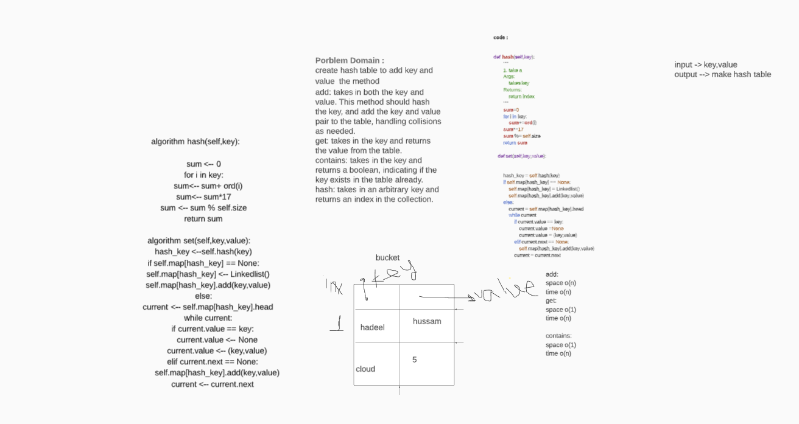

# Hashtables
create hash table to add key and value  the method
add: takes in both the key and value. This method should hash the key, and add the key and value pair to the table, handling collisions as needed.
get: takes in the key and returns the value from the table.
contains: takes in the key and returns a boolean, indicating if the key exists in the table already.
hash: takes in an arbitrary key and returns an index in the collection.

## Approach & Efficiency
<!-- What approach did you take? Why? What is the Big O space/time for this approach? -->
add:
space o(n)
time o(n)
get:
space o(1)
time o(n)

contains:
space o(1)
time o(n)

## API
