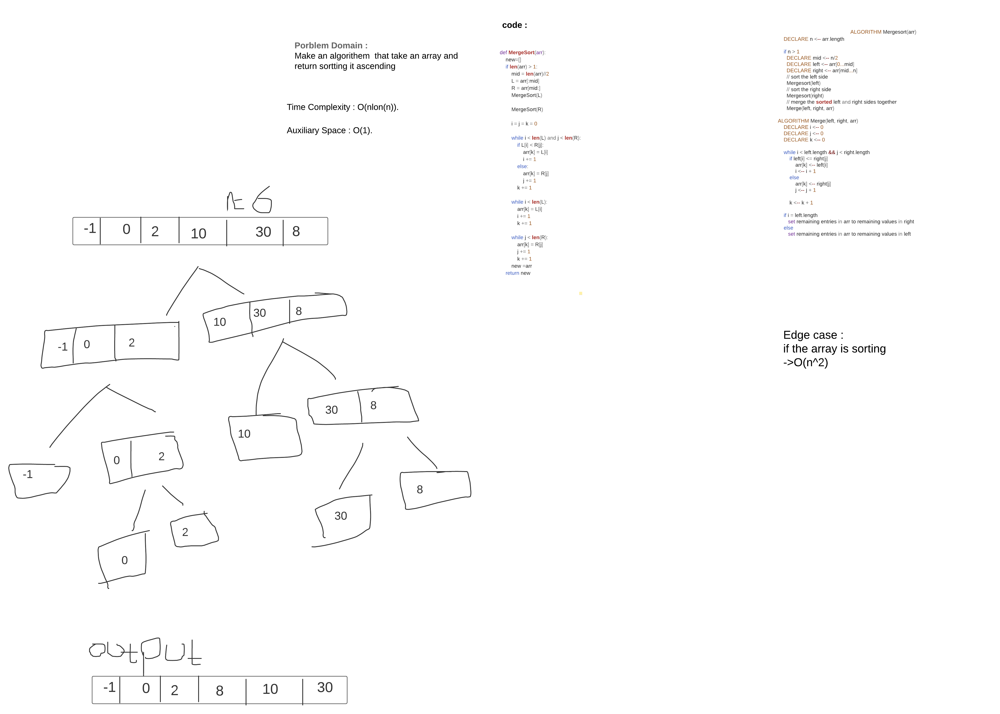

# Challenge Summary
take ean array and sort it using merge sort algorithm that divded the array into sub two array left and right and left and compare the value and return sorted array 

## Approach & Efficiency
Space Complexity o(1)
time o(n log(n))
## Solution

