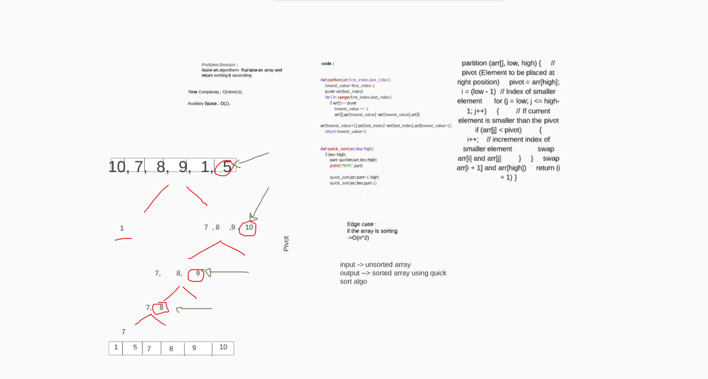

### QUICK SORT:
It picks an element as pivot and partitions the given array around the picked pivot. There are many different versions of quickSort that pick pivot in different ways.

Always pick first element as pivot.
Always pick last element as pivot ---> that was implemented 
Pick a random element as pivot.
Pick median as pivot.

## Challenge
+ Make two function partion and quick_sort to sort array  

## Approach & Efficiency
+ Space complixty -> O(n log(n))

+ Time complixity -> O(1)

## Solution

