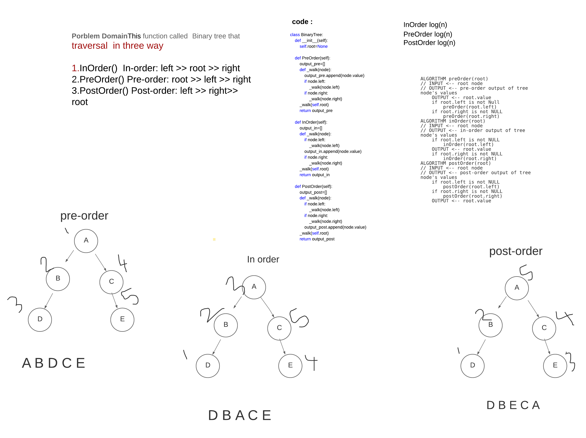
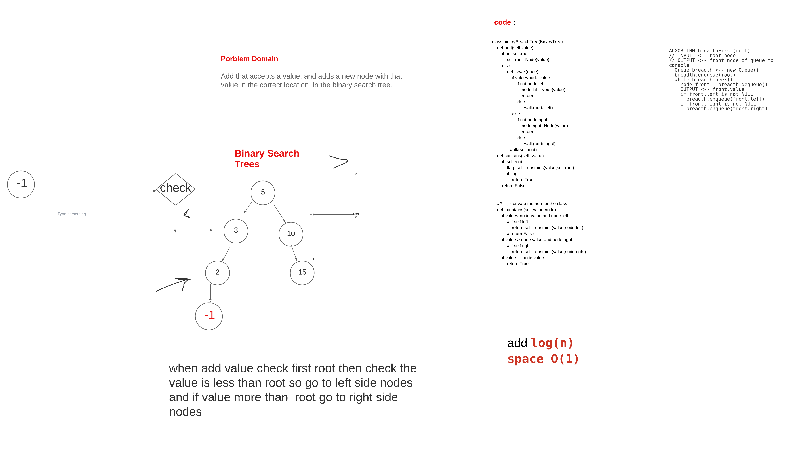

# Binary Trees
Tree represents the nodes connected by edges. It is a non-linear data structure. It has the following properties.
Depth First
    Depth first traversal is where we prioritize going through the depth (height) of the tree first. 
    There are multiple ways to carry out depth first traversal,
     and each method changes the order in which we search/print the root.
    Here are three methods for depth first traversal
traversal  in three way 

# BST
Add that accepts a value, and adds a new node with that value in the correct location  in the binary search tree

## Challenge BT
<!-- Description of the challenge -->
1.InOrder()  In-order: left >> root >> right
2.PreOrder() Pre-order: root >> left >> right
PostOrder() Post-order: left >> right>> root 

## Challenge BST
when add value check first root then check the value is less than root so go to left side nodes
and if value more than  root go to right side nodes

## Approach & Efficiency
<!-- What approach did you take? Why? What is the Big O space/time for this approach? -->
BT 
InOrder log(n)
PreOrder log(n)
PostOrder log(n)

BST 
add log(n) 
space O(1)

## API BT

## API BST
