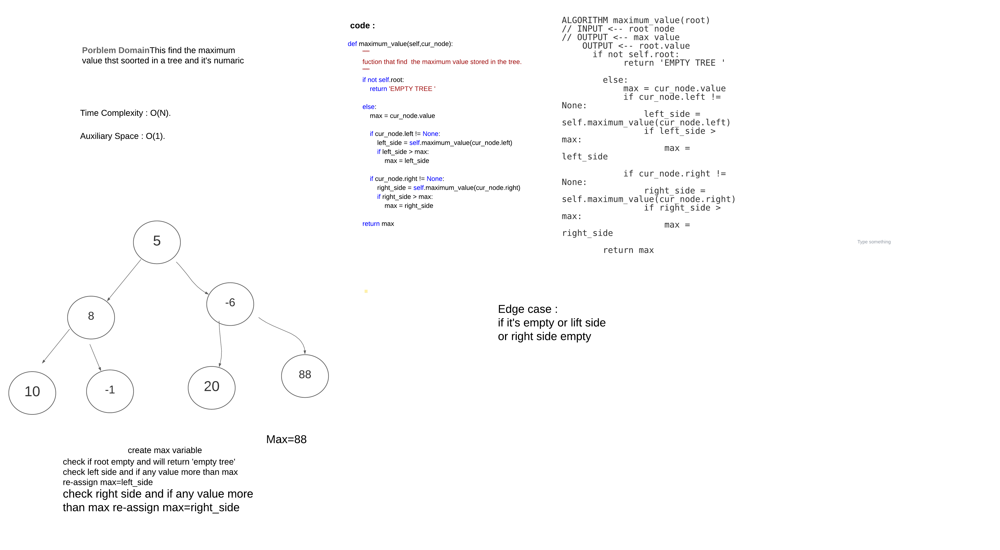

# Challenge Summary
find the maximum value thst soorted in a tree and it's numaric 
## Challenge Description
create max variable 
check if root empty and will return 'empty tree'
check left side and if any value more than max re-assign max=left_side 
check right side and if any value more than max re-assign max=right_side 

## Approach & Efficiency
Time Complexity : O(N).

Auxiliary Space : O(1).
## Solution
