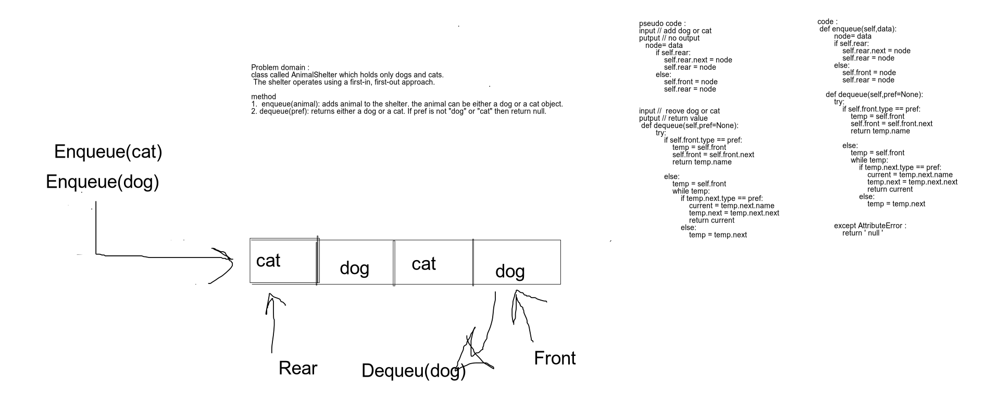

### Fifo animal shelter 
class called AnimalShelter which holds only dogs and cats. The shelter operates using a first-in, first-out approach.

method 
+ enqueue(animal): adds animal to the shelter. animal can be either a dog or a cat object.
+ dequeue(pref): returns either a dog or a cat. If pref is not "dog" or "cat" then return null.

## Approach & Efficiency
<!-- What approach did you take? Why? What is the Big O space/time for this approach? -->
enqueue(value)
time o(1)
space o(1)

dequeue(value)
time o(n)
space o(1)

## Solution
<!-- Embedded whiteboard image -->

