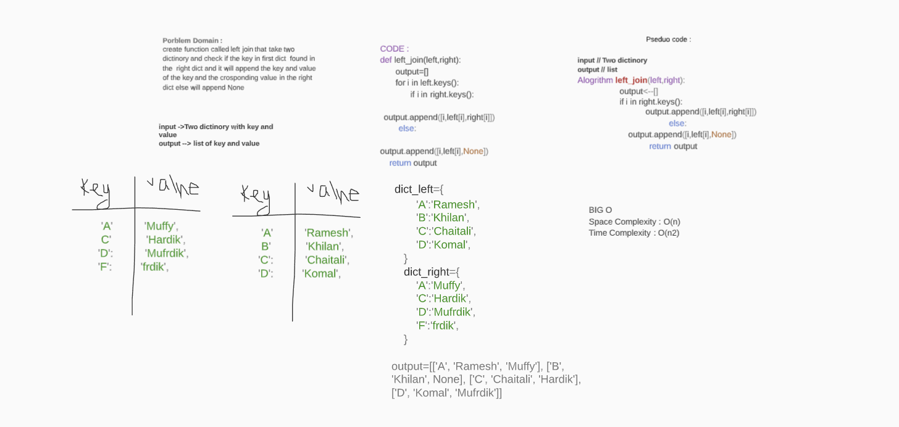

# Hashmap LEFT JOIN
Write a function that LEFT JOINs two hashmaps into a single data structure.
The first parameter is a hashmap that has word strings as keys, and a synonym of the key as values.
The second parameter is a hashmap that has word strings as keys, and antonyms of the key as values.

## Challenge
<!-- Description of the challenge -->
Combine the key and corresponding values (if they exist) into a new data structure according to LEFT JOIN logic.

## Approach & Efficiency
<!-- What approach did you take? Why? What is the Big O space/time for this approach? -->
space o(n)
time o(n2)
## Solution
<!-- Embedded whiteboard image -->
