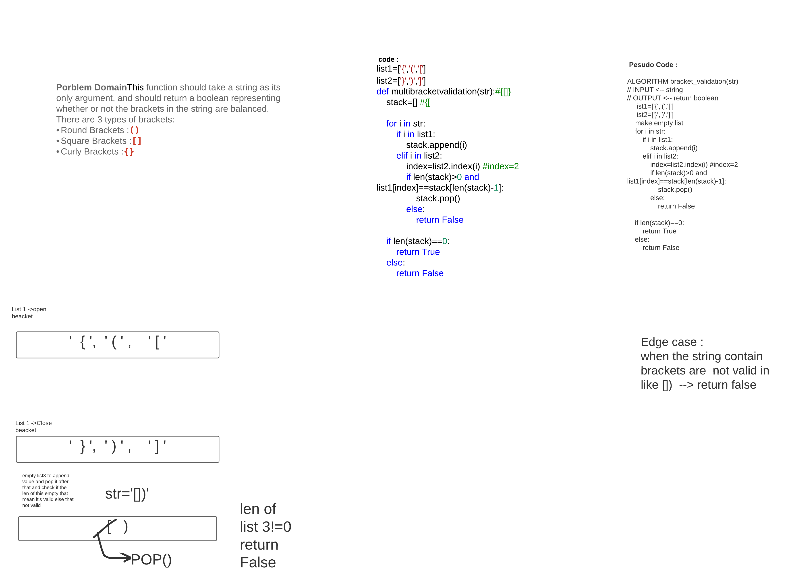

|multi bracket |[multi bracket](https://github.com/hadeelhhawajreh/data-structures-and-algorithms-c401/pull/15)|15-12-2020|

### Multi Bracket
Your function should take a string as its only argument, and should return a boolean representing whether or not the brackets in the string are balanced. There are 3 types of brackets:

+ Round Brackets : ()
+ Square Brackets : []
+ Curly Brackets : {}

## Challenge
find the best way to compare multi bracket 

## Approach & Efficiency
<!-- What approach did you take? Why? What is the Big O space/time for this approach? -->
time o(n)
space o(n)

## Solution
<!-- Embedded whiteboard image -->

