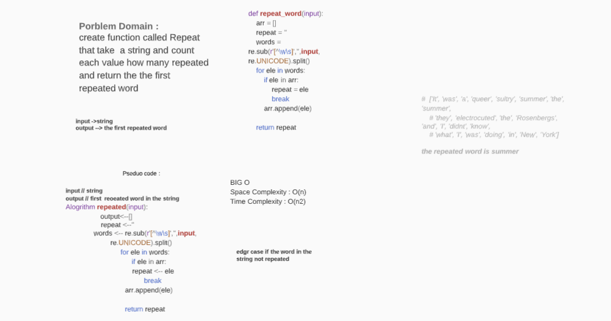

# REPETED WORD
create function called Repeat that take  a string and count each value how many repeated and return the the first repeated word 

## Challenge
<!-- Description of the challenge -->

## Approach & Efficiency
<!-- What approach did you take? Why? What is the Big O space/time for this approach? -->
space o(n)
time o(n2)
## Solution
<!-- Embedded whiteboard image -->
