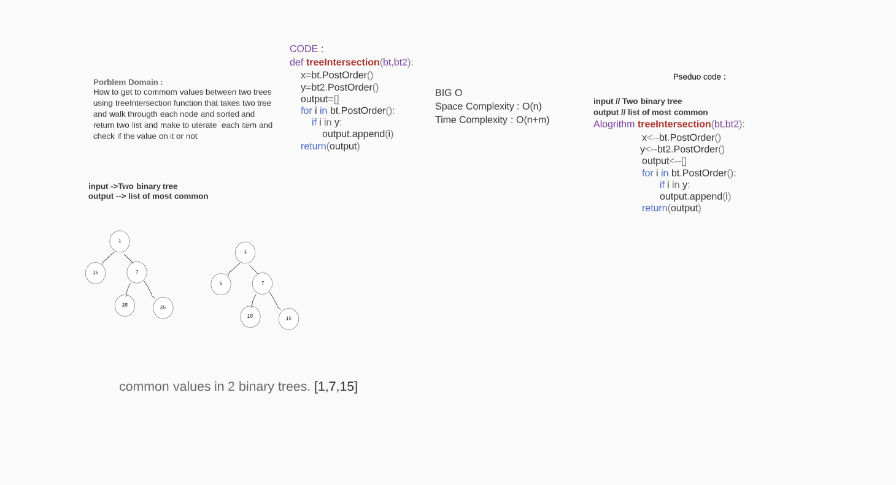

## Challenge Summary
How to get to commom values between two trees using treeIntersection function that takes two tree and walk througth each node and sorted and return two list and make to uterate  each item and check if the value on it or not :)
#### Challenge Description
when the two tree not equal of number of node 
#### Approach & Efficiency
> Space Complexity : O(n)

> Time Complexity : O(n+m)
## Solution

