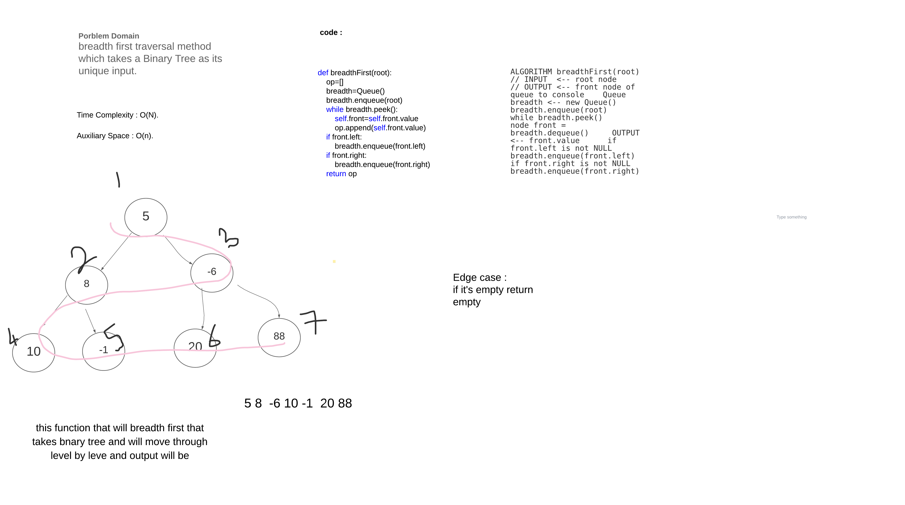

### breadthFirst
 breadth first traversal method which takes a Binary Tree as its unique input.

## Approach & Efficiency

######  Time Complexity: O(n) 
###### Space Complexity: O(n) 

## Solution
<!-- Embedded whiteboard image -->

