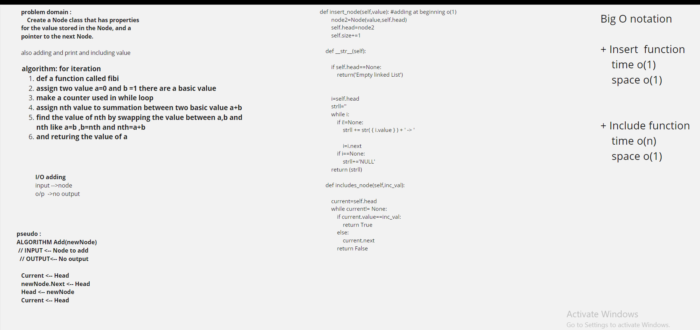

[PR 1](https://github.com/hadeelhhawajreh/data-structures-and-algorithms-c401/pull/5)

[PR 2](https://github.com/hadeelhhawajreh/data-structures-and-algorithms-c401/pull/6)

# Linked list 
linked list is a type of to add and orgnize data 
containes node 
each node has a value and next 

## Challenge
how to test using fixture but doesn't work ;(
and how to check the include value in ll 

## Approach & Efficiency
<!-- What approach did you take? Why? What is the Big O space/time for this approach? -->
+ Insert  function 
    time o(1)
    space o(1)

+ Include function 
    time o(n)
    space o(1)

## Solution
<!-- Embedded whiteboard image -->

---------------------------------------------------------------------------------------
### code challenge 6 
[code challenge 6](https://github.com/hadeelhhawajreh/data-structures-and-algorithms-c401/pull/9)

## Approach & Efficiency
<!-- What approach did you take? Why? What is the Big O space/time for this approach? -->
+ Insert at beginning   function 
    time o(1)
    space o(1)

+ appened at end function 
    time o(n)
    space o(1)

## Solution
<!-- Embedded whiteboard image -->

