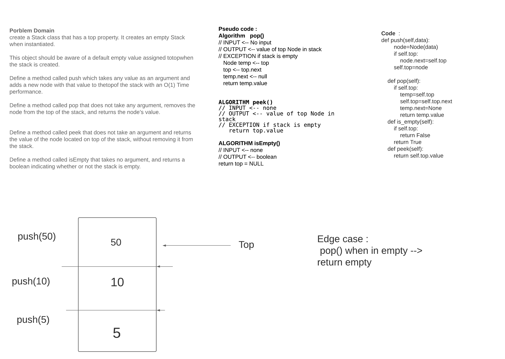
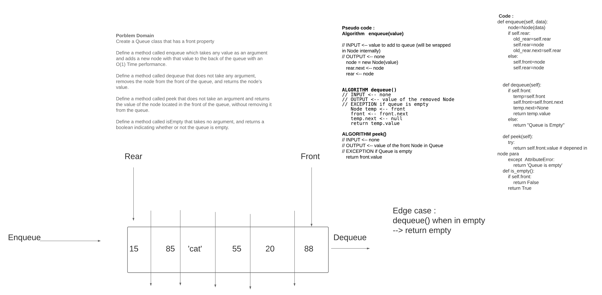

# Stacks and Queues
Stack and queue are type from linked list 

## Challenge
*Understand how to push (Add value to stack) and how stack look like 'imagine it '
and how to popping or removing the first value 'top' from the stack*
peek -> return the first value 'the top' of stack 

*Understand how to enqueue (Add value to queue) and how queue look like 'imagine it '
and how to dequeue or removing the first value 'front' from the queue 
peek -> return the first value 'the front' of stack *

and in the  queue, we have  two pointer, front and rear  rather than stack one pointer top

## Approach & Efficiency
>> **Stack**

>> pop() ->o(1)

>> push(value)-> o(1)

>> isEmpty ->o(1)

>> peek()-> o(1)

>> **Queue**

>> Dequeue() ->o(1)

>> Enqueue(value)-> o(1)

>> isEmpty ->o(1)

>> Peek()-> o(1)

## API
<!-- Description of each method publicly available to your Stack and Queue-->

